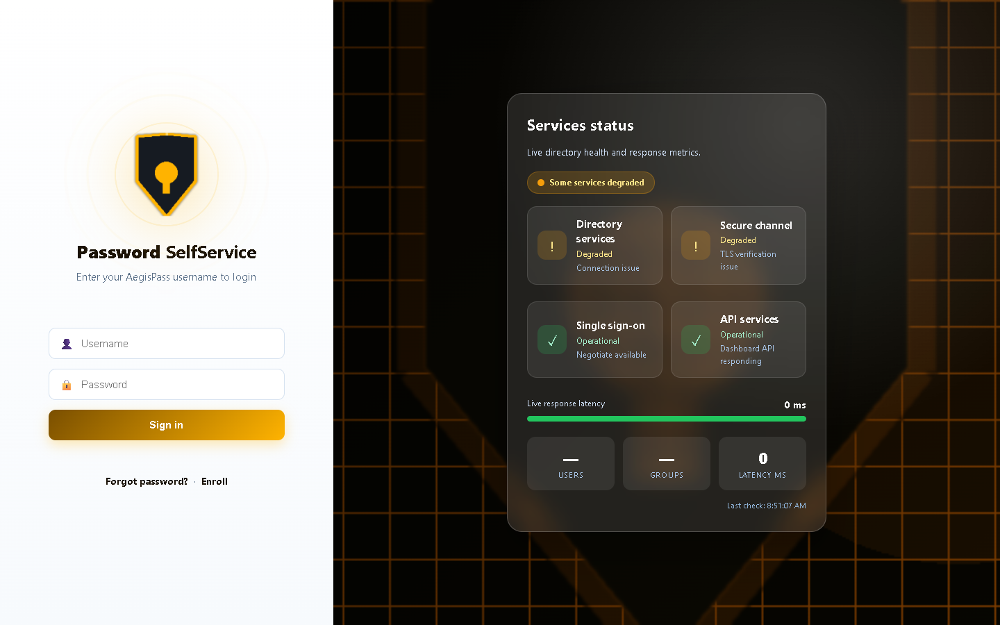

<div align="center">


# AegisPass

Self-service Active Directory password reset portal


</div>

---

<p align="center">
  
</p>

<br>

---

## Features

- **Self-Service Reset** — Employees reset their own AD password.
- **LDAPS Support** — Secure LDAP connections to Active Directory.
- **Admin Console** — Manage users, OUs, and portal settings.
- **Audit Logging** — Track all password reset attempts.
- **Policy Enforcement** — Enforces AD password policies.
- **Email Notifications** — Alert admins of failed attempts.
- **Python / Flask** — Lightweight, security-focused backend.
- **Docker & Docker Compose** — One-command deployment.

## Quick Start

```bash
git clone https://github.com/OneByJorah/AegisPass.git
cd AegisPass

cp .env.example .env
docker compose up -d
```

Open **http://localhost:8000** in your browser.

## Configuration

| Variable | Default | Description |
|----------|---------|-------------|
| `AD_LDAP_SERVER` | — | Domain controller hostname |
| `AD_LDAP_PORT` | `636` | LDAPS port |
| `AD_BASE_DN` | — | Base DN for user searches |
| `AD_SERVICE_ACCOUNT` | — | Service account username |
| `AD_SERVICE_PASSWORD` | — | Service account password |
| `ADMIN_EMAIL` | — | Admin email for notifications |
| `PORT` | `5000` | Application port |

## Project Structure

```
AegisPass/
├── app/
│   ├── __init__.py          # Flask app factory
│   ├── config.py            # Environment-based configuration
│   ├── auth/                # Login, SSO Negotiate, logout
│   ├── ad/                  # LDAP/AD operations, health, safety guards
│   ├── routes/              # UI, API, workflow, enrollment blueprints
│   ├── templates/           # Jinja2 templates
│   └── static/              # CSS, JS, images, PWA assets
├── requirements.txt         # Python dependencies
├── Dockerfile               # Production container image
├── docker-compose.yml       # Local Docker deployment
├── install.sh / install.ps1 # One-command installers
├── .env.example             # Configuration template (copy to .env)
├── docs/assets/             # Banner & screenshots
└── README.md
```

## Contributing

Contributions are welcome. Please see [CONTRIBUTING.md](CONTRIBUTING.md) for guidelines and [CODE_OF_CONDUCT.md](CODE_OF_CONDUCT.md) for community standards.

## Security

For security concerns, see [SECURITY.md](SECURITY.md). Please report vulnerabilities to **info@jorahone.com** — do not use public issues.

## License

MIT © Jhonattan L. Jimenez

---

## 🤝 Contributing

See [CONTRIBUTING.md](CONTRIBUTING.md). All contributions follow the [Code of Conduct](CODE_OF_CONDUCT.md).

## 🔒 Security

Found a vulnerability? Please follow our [Security Policy](SECURITY.md) and report privately to `security@jorahone.com`.

## 📄 License

[MIT License](LICENSE) © Jhonattan L. Jimenez (OneByJorah)

---

<p align="center">Built with 🌴 by <a href="https://github.com/OneByJorah">OneByJorah</a> · <a href="https://jorahone.com">jorahone.com</a></p>
