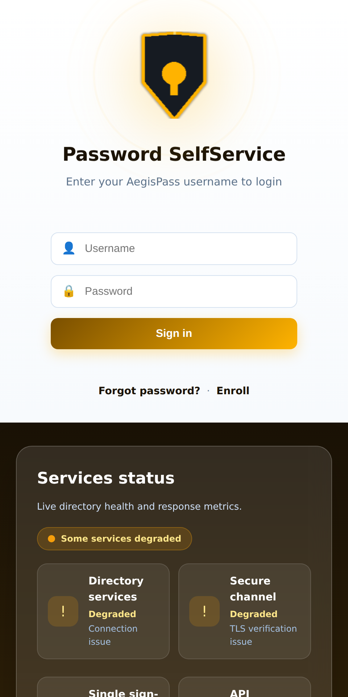
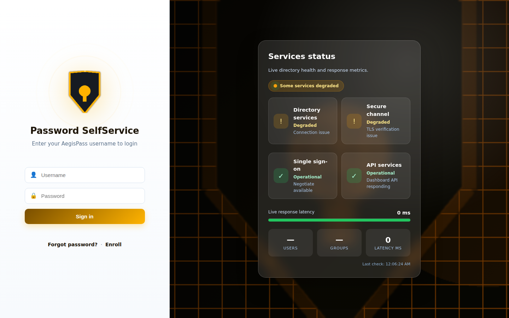

<div align="center">


# AegisPass

**A self-service Active Directory password reset portal for Windows domain users — LDAPS-pinned, workflow-driven, and fully audited.**

<a href="https://github.com/OneByJorah/AegisPass/stargazers"></a>
<a href="https://github.com/OneByJorah/AegisPass/commits"></a>


</div>


## What This Is

AegisPass is a Flask web application that gives end users secure self-service access to common Active Directory operations — password resets, account unlocks, and TOTP-based MFA enrollment — while enforcing safety guards on privileged Tier-0 objects and recording every action to an audit trail.

It exists so helpdesks can stop resetting passwords by hand and stop granting standing write access to Domain Admins. The portal connects to the domain controller over **LDAPS with SHA-256 certificate fingerprint pinning** (fail-closed), keeps a **read-only Global Catalog** connection for cross-domain lookups, and supports **Kerberos/Negotiate SSO** with a password-form fallback.

The current application consolidates the earlier PyPass and AD-Passreset-Portal tools, retained under `legacy/` for reference.

## Quick Start

```bash
git clone https://github.com/OneByJorah/AegisPass.git && cd AegisPass
cp .env.example .env   # set SECRET_KEY_FLASK, AD_HOST, AD_BASE_DN, AD_BIND_USER, AD_BIND_PASSWORD
docker compose up -d
```

Open **http://localhost:8000**. Health check: **http://localhost:8000/health**.

## Features

- **Self-service password reset** — users reset expired or forgotten passwords from the portal; expiry reminders fire through the workflow engine at configurable day thresholds.
- **Account unlock & lifecycle** — create, update, disable/enable, unlock, and delete users, plus force-change-at-next-logon.
- **Tier-0 safety guards** — changes to Domain Admins, Enterprise Admins, Schema Admins, and KRBTGT are blocked or gated, preventing catastrophic misconfiguration.
- **Hardened LDAP management channel** — LDAPS on port 636 with `AD_CERT_FINGERPRINT` pinning; connections to a mismatched DC are refused.
- **Read-only Global Catalog** — forest-wide searches on port 3268, never used for writes.
- **SSO / Kerberos** — GSSAPI/Negotiate login for domain-joined machines, with username/password fallback for the rest.
- **Self-service enrollment** — recovery profile plus TOTP MFA enrollment via any authenticator app.
- **Audit trail** — every reset, enrollment, and workflow action logged with user, timestamp, source IP, and result.

## Architecture

```
┌─────────────────────────────────────────────────────┐
│                   Browser (PWA)                     │
│            Flask UI + Service Worker                │
└──────────────────────┬──────────────────────────────┘
                       │ HTTP :8000
                       ▼
┌─────────────────────────────────────────────────────┐
│               Gunicorn (2 workers)                  │
│                  ┌──────────────┐                   │
│                  │  Flask App   │                   │
│                  └──────┬───────┘                   │
│         ┌───────────────┼───────────────┐           │
│         ▼               ▼               ▼           │
│  ┌────────────┐  ┌────────────┐  ┌────────────┐     │
│  │   Routes   │  │   Safety   │  │  Workflow  │     │
│  │ ui / api / │  │   Guards   │  │   Engine   │     │
│  │ enrollment │  │            │  │            │     │
│  └─────┬──────┘  └─────┬──────┘  └─────┬──────┘     │
│        └───────────────┼───────────────┘            │
│                        ▼                            │
│               ┌───────────────┐                     │
│               │  AD Connector │                     │
│               │  (ldap3)      │                     │
│               └───────┬───────┘                     │
└───────────────────────┼─────────────────────────────┘
                        │ LDAPS/636   GC/3268
                        ▼
              ┌───────────────────┐
              │  Active Directory │
              │  Domain Forest    │
              └───────────────────┘
```

### Project layout

```
AegisPass/
├── app/
│   ├── ad/            # AD connector, safety guards, health (ldap3)
│   ├── auth/          # LDAP bind + Kerberos/GSSAPI SSO
│   ├── routes/        # ui, api, enrollment, workflows blueprints
│   ├── static/        # PWA assets, CSS, JS
│   └── templates/     # base.html, auth/login.html
├── config/workflows.json
├── deploy/            # nginx config, install script
├── docker-compose.yml
├── Dockerfile         # python:3.11-slim + gunicorn
├── legacy/            # PyPass + AD-Passreset-Portal (reference)
└── systemd/aegispass.service
```

## Configuration

Copy `.env.example` to `.env`. The most important variables:

### Active Directory (writable, LDAPS)

| Variable | Default | Description |
|---|---|---|
| `AD_HOST` | — | Domain controller hostname or IP |
| `AD_LDAPS_PORT` | `636` | LDAPS port |
| `AD_DOMAIN` | — | AD domain (e.g. `example.com`) |
| `AD_BASE_DN` | — | Base DN for searches (e.g. `DC=example,DC=com`) |
| `AD_BIND_USER` | — | Service account DN for write operations |
| `AD_BIND_PASSWORD` | — | Service account password |
| `AD_CERT_FINGERPRINT` | — | Pinned SHA-256 certificate fingerprint (fail-closed) |

### Global Catalog (read-only)

| Variable | Default | Description |
|---|---|---|
| `AD_GC_HOST` | — | Global Catalog server hostname |
| `AD_GC_PORT` | `3268` | Global Catalog LDAP port |

### Application

| Variable | Default | Description |
|---|---|---|
| `SECRET_KEY_FLASK` | — | Flask session secret key |
| `SESSION_LIFETIME_MINUTES` | `30` | Session lifetime |
| `DEBUG` | `False` | Enable debug mode |
| `COMPANY` / `APP_NAME` | `AegisPass` | Display branding |
| `EXPIRY_REMINDER_DAYS` | `7,3` | Comma-separated password-expiry reminder thresholds |

### Integrations

| Variable | Default | Description |
|---|---|---|
| `SMTP_ENABLED` / `SMTP_HOST` / `SMTP_PORT` | `False` / — / `25` | Internal SMTP relay settings |
| `SMS_PROVIDER` | `none` | `none`, `mock`, `gammu`, or `twilio` |
| `SMS_GATEWAY_URL` / `SMS_API_TOKEN` | — | Self-hosted Gammu REST gateway |
| `SLACK_BOT_TOKEN` / `SLACK_ACTIVATION` | — / `False` | Slack notifications |
| `RECAPTCHA_ENABLED` / `RECAPTCHA_PUBLIC_KEY` / `RECAPTCHA_PRIVATE_KEY` | `False` / — / — | Login CAPTCHA |

> [!NOTE]
> Production deployments require at minimum `SECRET_KEY_FLASK`, `AD_HOST`, `AD_BASE_DN`, `AD_BIND_USER`, `AD_BIND_PASSWORD`, and a valid `AD_CERT_FINGERPRINT`.

## API

The REST API is mounted under `/api` and covered by `app/routes/api.py`:

| Method | Endpoint | Purpose |
|---|---|---|
| GET | `/api/user-stats`, `/api/device-stats` | Dashboard counts |
| GET/POST | `/api/users` | List / create users |
| GET/PATCH/DELETE | `/api/users/<dn>` | Read / update / delete a user |
| POST | `/api/users/<dn>/enable`, `/unlock` | Enable / unlock |
| POST | `/api/users/<dn>/password` | Administrative password set |
| POST | `/api/self/password`, `/self/reset-request`, `/self/reset-confirm` | Self-service flows |
| GET/POST/DELETE | `/api/groups`, `/api/groups/<dn>` | Group management |
| GET | `/api/audit` | Audit log |
| GET | `/health`, `/health/ldap`, `/status.json` | Health / status |

## Use Cases

1. **Helpdesk deferral** — domain users self-reset passwords and unlock accounts without queueing a ticket.
2. **Compliance** — audit logging and Tier-0 guards make privileged changes reviewable and hard to misfire.
3. **MSP / enterprise AD** — one portal over a hardened LDAPS channel with pinned certificates, plus forest-wide GC lookups.

## Tech Stack

Python 3.11, Flask 3.1, ldap3, pyotp, gunicorn, Docker / Docker Compose, nginx, systemd.

## Screenshots

| View | |
|---|---|
|  |  |
|  |  |

## Security

- SHA-256 certificate fingerprint pinning on the LDAPS channel (fail-closed).
- Tier-0 objects protected by safety guards.
- Non-root container (`appuser`); non-sensitive login status panel that avoids leaking internal hostnames.
- Report vulnerabilities privately via [GitHub Security Advisories](https://github.com/OneByJorah/AegisPass/security/advisories/new).

## Contributing

Fork, branch, and open a pull request — see [CONTRIBUTING.md](CONTRIBUTING.md). [Open an issue](https://github.com/OneByJorah/AegisPass/issues) for bugs or ideas.

## License

MIT — see [LICENSE](LICENSE).

## Connect

- [jorahone.com](https://jorahone.com)
- [GitHub Org](https://github.com/OneByJorah)
- [info@jorahone.com](mailto:info@jorahone.com)
