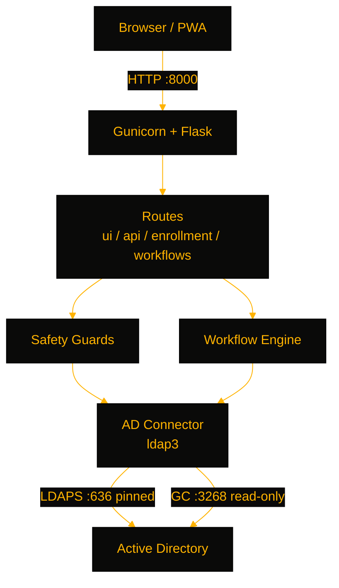

# AegisPass

> A self-service Active Directory password reset portal — LDAPS-pinned, Tier-0-guarded, workflow-driven, and audited end to end.

[](https://github.com/OneByJorah/AegisPass)
[](https://github.com/OneByJorah/AegisPass)
[](https://github.com/OneByJorah/AegisPass/stargazers)
[](https://github.com/OneByJorah/AegisPass/commits)
[](https://github.com/OneByJorah/AegisPass/actions)


## What This Is

AegisPass is a Flask web app that gives domain users secure self-service access to common Active Directory operations — password resets, account unlocks, and TOTP MFA enrollment — while blocking writes to privileged Tier-0 objects and recording every action to an audit trail. It exists so helpdesks stop resetting passwords by hand and stop granting standing write access to Domain Admins. The portal connects over **LDAPS with SHA-256 certificate fingerprint pinning** (fail-closed), keeps a **read-only Global Catalog** connection for forest-wide lookups, and supports Kerberos/Negotiate SSO with a password-form fallback.

## Quick Start

```bash
git clone https://github.com/OneByJorah/AegisPass.git && cd AegisPass
cp .env.example .env   # set SECRET_KEY_FLASK, AD_HOST, AD_BASE_DN, AD_BIND_USER, AD_BIND_PASSWORD
docker compose up -d
```

Open **http://localhost:8000** (health check at `/health`).

## Features

- **Self-service password reset** — users reset expired or forgotten passwords; expiry reminders fire through the workflow engine at configurable thresholds.
- **Account lifecycle** — create, update, enable/disable, unlock, and delete users, plus force-change-at-next-logon.
- **Tier-0 safety guards** — changes to Domain Admins, Enterprise Admins, Schema Admins, and KRBTGT are blocked or gated.
- **Pinned LDAPS channel** — port 636 with `AD_CERT_FINGERPRINT` verification; mismatched DCs are refused.
- **Read-only Global Catalog** — forest-wide searches on port 3268, never used for writes.
- **SSO** — GSSAPI/Negotiate login for domain-joined machines, username/password fallback otherwise.
- **TOTP MFA enrollment** — self-service recovery profile plus authenticator-app enrollment with QR codes.
- **Full audit trail** — every reset, enrollment, and workflow action logged with user, timestamp, source IP, and result.

## Architecture



## Stack

Python 3.11 · Flask 3.1 · ldap3 · pyotp · gunicorn · Docker · nginx · systemd

## Configuration

Minimum production variables in `.env`: `SECRET_KEY_FLASK`, `AD_HOST`, `AD_BASE_DN`, `AD_BIND_USER`, `AD_BIND_PASSWORD`, and `AD_CERT_FINGERPRINT`. Optional integrations: SMTP relay, SMS via Gammu/Twilio, Slack notifications, and reCAPTCHA on login. See [`.env.example`](.env.example) for the full list.

## Contributing

Fork, branch, and open a pull request — see [CONTRIBUTING.md](CONTRIBUTING.md). [Open an issue](https://github.com/OneByJorah/AegisPass/issues) for bugs or ideas. Report vulnerabilities privately via [GitHub Security Advisories](https://github.com/OneByJorah/AegisPass/security/advisories/new).

## License

MIT — see [LICENSE](LICENSE).
